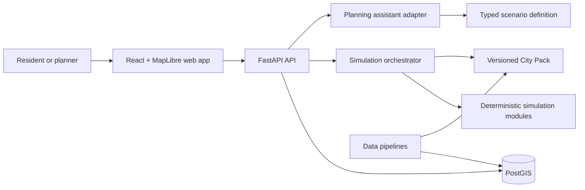

# Architecture overview

## System boundary

Citynario accepts a structured scenario, resolves one City Pack, executes compatible deterministic
simulation modules, records provenance, and returns results suitable for maps, charts, tables, and
plain-language summaries.



The assistant ends at the typed scenario boundary. Only deterministic modules produce indicators.
This separation makes results reproducible and prevents generated prose from becoming evidence.

## Deployable units

- `apps/api` owns HTTP, configuration, authentication hooks, persistence, and composition.
- `apps/web` owns the Next.js public interaction model, map, accessible result views, and API state.
- PostgreSQL/PostGIS stores scenarios, spatial features, data releases, and eventually job state.
- Background workers are intentionally deferred. Long-running pipelines and models can later use a
  queue without changing the core `SimulationModule` contract.

## Python dependency direction

```text
apps/api
  -> citynario-core
  -> citynario-assistant -> citynario-core
  -> citynario-simulations -> citynario-core
  -> citynario-pack-lynn -> citynario-core

citynario-pipelines -> city pack manifests and external data (offline path)
```

Core never imports the API, a City Pack, a model implementation, or a vendor AI SDK. The API is the
composition root that registers installed packs and modules.

## Scenario execution

1. Validate the request against the versioned scenario contract.
2. Resolve the requested city pack and a pinned pack version.
3. Select modules and order them by declared dependencies.
4. Run each module with an immutable context and prior results.
5. Return indicators, assumptions, warnings, module versions, and the pack version.
6. Persist the input and output as an auditable scenario run (next vertical slice).

## Scaling boundary

Citynario does not attempt to load or model the entire United States. The shared platform runs any
installed, validated City Pack. A deployment may host one city or a curated catalog. National scale
therefore means repeatable onboarding, common contracts, and distributed data releases—not one
unbounded national database or a promise of uniform local accuracy.

## Security and privacy

- Public data ingestion is offline and allow-listed by the source catalog.
- Secrets enter only through runtime configuration.
- Data licenses and checksums travel with data releases.
- Aggregate public outputs are the default. Small-cell suppression belongs in pipelines, not UI.
- Authentication and authorization are extension points; the MVP exposes no administrative writes.
