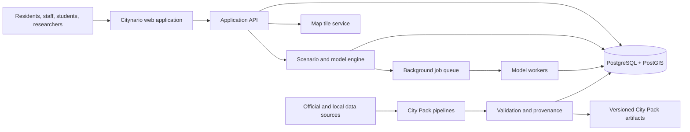
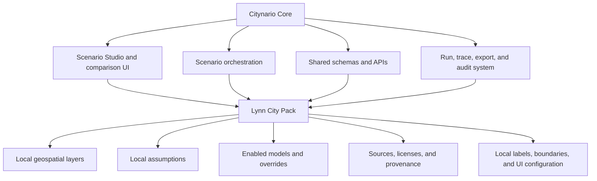
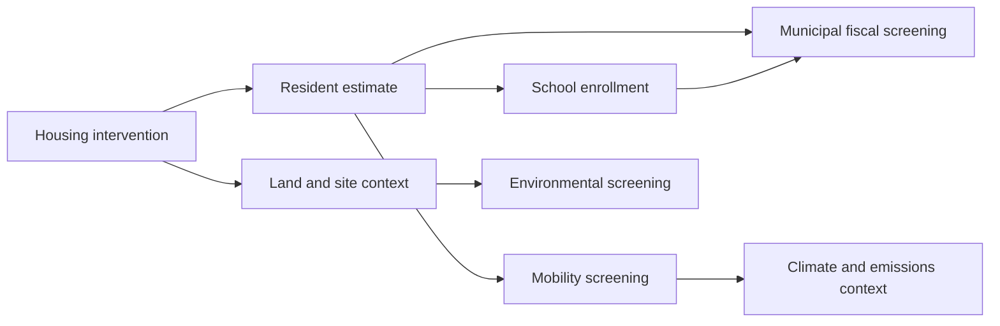
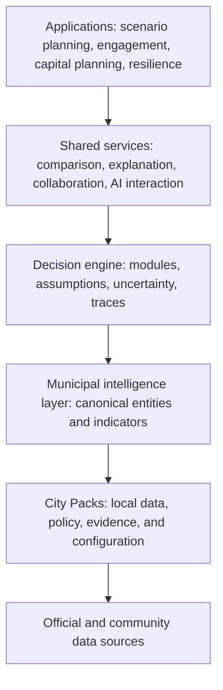

# Citynario

## Municipal Decision-Support Platform — Project Specification

> **Tagline:** Explore the future of a city, one transparent scenario at a time.

| Document field | Value |
|---|---|
| Project name | **Citynario** |
| Initial geography | **Lynn, Massachusetts** |
| Document status | Finalized product and engineering specification, v1.0 |
| Date | August 2, 2026 |
| Product category | Civic technology, geospatial decision support, scenario planning |
| Intended delivery | Public, open-source, portfolio-grade web platform |

---

## 1. Executive summary

Citynario is a public, map-based platform for exploring the plausible effects of municipal planning decisions. It begins with Lynn, Massachusetts, and a focused question:

> **What could happen if new housing were built here?**

A user selects a place, describes a development scenario, and sees transparent estimates of potential effects on residents, public-school enrollment, transportation, municipal finances, and the environment. Results appear as ranges rather than false-precision forecasts. Every result can be traced to a source, an assumption, and a calculation.

Citynario is a **decision-support system**, not a prediction machine, permitting tool, or substitute for professional engineering analysis. Its purpose is to help residents, students, planners, researchers, and public officials understand tradeoffs, compare alternatives, and ask better questions.

The platform is designed around two separable layers:

1. **The Citynario Core** — the reusable application, scenario engine, data contracts, map experience, comparison tools, APIs, and audit system.
2. **City Packs** — versioned, locally validated bundles of geographic data, assumptions, source records, and configuration for individual municipalities.

The first City Pack is **Lynn, MA**. A second-city pilot will test whether the architecture is genuinely reusable. Citynario does not need to ingest every American municipality or maintain a national digital twin. It scales by supporting additional City Packs when reliable local data and maintainers are available.

The long-term vision is for Citynario to become an **operating system for municipal intelligence**: a shared foundation on which scenario planning, public engagement, infrastructure analysis, budgeting, climate resilience, and other civic applications can run. Scenario planning is the first flagship application and remains the product's organizing interaction.

---

## 2. Vision, mission, and positioning

### 2.1 Vision

Municipal decisions should be understandable before they are irreversible.

Citynario imagines a future in which a resident, student, planner, or elected official can explore a proposed change, understand the assumptions behind an estimate, compare meaningful alternatives, and discuss tradeoffs using a shared factual foundation.

### 2.2 Mission

Build accessible, transparent, and reusable tools that help communities reason about possible futures without pretending to predict them perfectly.

### 2.3 Product promise

Citynario will make each modeled result:

- **Inspectable:** users can open the calculation and see how it works.
- **Sourced:** inputs and assumptions link to their origins.
- **Versioned:** a saved result can be reproduced later.
- **Uncertain by design:** outputs use ranges and sensitivity analysis when the evidence warrants them.
- **Comparable:** alternatives use the same baseline and assumptions unless the user deliberately changes them.
- **Accessible:** the essential meaning is available without GIS or data-science expertise.

### 2.4 One-sentence explanation

> Citynario is a city sandbox that helps people compare the likely tradeoffs of local planning choices using a map, transparent assumptions, and evidence-based scenario models.

### 2.5 Thirty-second explanation

> Imagine Lynn is considering 200 new apartments near downtown. In Citynario, you place that proposal on a map, choose basic details such as unit mix and parking, and compare it with another option. The platform estimates plausible ranges for new residents, school enrollment, travel demand, fiscal effects, and environmental exposure. Every number explains where it came from. It is not claiming to predict the future; it is helping people understand what assumptions drive the conversation.

### 2.6 Positioning

Citynario sits between several existing categories without being identical to any one of them:

| Category | What Citynario borrows | What makes Citynario different |
|---|---|---|
| GIS viewer | Spatial context and layered maps | Users create and compare future scenarios rather than only viewing current conditions |
| Planning model | Structured calculations | Models are simplified, public-facing, inspectable, and modular |
| Digital twin | A shared representation of place | Citynario does not promise a real-time or perfectly faithful replica |
| Dashboard | Summaries and indicators | The core interaction is changing assumptions and observing effects |
| Public-engagement tool | Accessible communication | Results remain connected to a reproducible analytical model |
| AI assistant | Natural-language interaction, later | AI may structure user intent but never invents authoritative results |

---

## 3. Product boundaries

The most important design decision is what Citynario will **not** attempt to be.

### 3.1 Citynario is

- A scenario exploration and comparison platform.
- A transparent rules-and-evidence engine.
- A reusable municipal data foundation.
- A public explanation layer over complex planning questions.
- A framework that can improve as better local models become available.
- An open-source project designed to be credible, teachable, and extensible.

### 3.2 Citynario is not

- A legally authoritative zoning or parcel system.
- A development permit, environmental review, or traffic-impact study.
- A real-time operational control center.
- A precise forecast of individual behavior.
- A replacement for planners, engineers, educators, or community deliberation.
- A promise to model every municipal system.
- A national database that must hold every local record centrally.
- An AI chatbot that produces unsupported planning claims.

### 3.3 The geographic boundary

The first production boundary is the municipal extent of Lynn, Massachusetts, plus only the surrounding context required to interpret cross-boundary systems such as roads, transit, watersheds, and school or labor markets.

Regional datasets may be stored when they simplify processing, but the Lynn City Pack only exposes and validates the portion needed for Lynn scenarios.

### 3.4 The analytical boundary

The first release models one scenario family well: **residential development**. It estimates first-order effects using published sources and explicit assumptions. It does not model second- and third-order feedback loops such as long-run housing-price equilibrium, induced migration across the region, or detailed network traffic assignment.

### 3.5 The scaling boundary

Citynario scales through independently maintained City Packs. The core team does not need to onboard the entire United States. A municipality is supported only when its City Pack passes validation and names a maintainer, data date, and model scope.

### 3.6 Accuracy statement

All public result pages must display a concise version of the following statement:

> **Citynario estimates plausible impacts under stated assumptions. Results are for exploration and decision support, not prediction, legal determination, or professional engineering certification.**

---

## 4. Product principles

1. **Transparency over sophistication.** A simple model that can be inspected is preferable to an opaque model with marginally better fit.
2. **Ranges over false precision.** Uncertainty is a product feature, not a footnote.
3. **Comparison over isolated scores.** The platform should answer “compared with what?”
4. **Local knowledge over universal defaults.** National defaults can bootstrap a City Pack, but locally validated assumptions take precedence.
5. **Provenance by default.** No public input exists without a source, retrieval date, geography, license, and transformation record.
6. **Reproducibility over novelty.** A result must be regenerable from its scenario, City Pack version, model version, and assumptions.
7. **Progressive disclosure.** A first-time user sees a clear story; an expert can inspect formulas, metadata, and raw records.
8. **Modularity over premature microservices.** Components should have clean boundaries while remaining simple to run locally.
9. **Public value over feature volume.** New modules earn a place by improving a real decision.
10. **Accessibility and multilingual readiness from the start.** Public-facing civic software must not assume perfect English, vision, mobility, or technical literacy.

---

## 5. Audiences and jobs to be done

### 5.1 Primary audiences

#### Residents and community groups

**Job:** “Help me understand what a proposal could change in my neighborhood and which assumptions matter.”

Needs:

- Plain-language summaries.
- Mobile-friendly exploration.
- Visible sources and caveats.
- Side-by-side alternatives.
- Exportable material for a meeting.

#### Municipal staff and planners

**Job:** “Help me screen options, communicate tradeoffs, and expose a consistent baseline before detailed study.”

Needs:

- Reproducible calculations.
- Configurable local assumptions.
- Data freshness and quality indicators.
- Downloadable scenario records.
- Clear distinction between screening and formal analysis.

#### Educators and students

**Job:** “Help me teach systems thinking, local government, statistics, geography, and uncertainty using a real place.”

Needs:

- Guided examples.
- Explanations of formulas.
- Safe public datasets.
- Easy reset and remix of scenarios.
- Classroom-ready exports.

### 5.2 Secondary audiences

- Researchers evaluating civic models or public communication.
- Journalists explaining development proposals.
- Advocates testing competing claims.
- Developers extending the open-source platform.
- Other municipalities evaluating whether to create a City Pack.

### 5.3 Anti-personas

Citynario is not optimized for:

- Applicants seeking a legally binding entitlement decision.
- Engineers needing a certified traffic model.
- Analysts needing confidential person-level administrative data.
- Users seeking exact property valuation or investment advice.
- Agencies seeking a closed, proprietary system that cannot expose its assumptions.

---

## 6. Core concepts

| Term | Definition |
|---|---|
| **Baseline** | A versioned representation of current or reference conditions for a City Pack |
| **Scenario** | A structured set of changes applied to a baseline |
| **Alternative** | One scenario compared with another under a common baseline |
| **Intervention** | A specific modeled change, such as adding residential units to a site |
| **Assumption** | A value used by a model that is not directly observed for the proposed future |
| **Indicator** | A calculated output such as estimated residents or school seats demanded |
| **Module** | A bounded model that converts scenario inputs and context into outputs |
| **Core** | Reusable platform code and contracts shared by every city |
| **City Pack** | Versioned local data, assumptions, models, configuration, and provenance |
| **Model card** | Human- and machine-readable documentation of a module's purpose, method, evidence, limits, and validation |
| **Run** | One immutable execution of a scenario against exact data and model versions |
| **Trace** | The calculation graph showing how inputs became outputs |

---

## 7. Flagship use case

### 7.1 Question

> What might happen if housing is added at a selected location in Lynn?

### 7.2 Example scenario

A user creates two alternatives near downtown:

- **Alternative A:** 200 apartments, mostly studios and one-bedroom units, 0.6 parking spaces per unit.
- **Alternative B:** 150 mixed-size apartments, a larger affordable share, 0.35 parking spaces per unit, and added public open space.

Citynario compares:

- Estimated new residents.
- Estimated school-age children and public-school enrollment.
- Estimated daily person trips and vehicle trips.
- Transit and walk-access context.
- Indicative municipal revenue and service-cost ranges when reliable assumptions exist.
- Change in impervious surface and overlap with mapped environmental constraints.
- Which assumptions most influence each result.

### 7.3 Why this is the first use case

Residential development connects land use, population, schools, transportation, fiscal questions, and the environment without requiring every future module to be complete. It is visible, locally relevant, and well suited to a map-based comparison experience.

---

## 8. MVP definition

### 8.1 MVP outcome

The minimum viable product proves that a nontechnical user can create, understand, compare, save, and share two residential-development scenarios in Lynn, while an expert can audit every material calculation.

### 8.2 MVP capabilities

#### A. Explore the baseline

- View Lynn's municipal boundary, parcels or generalized sites, zoning, roads, transit, schools, and selected environmental constraints.
- Search an address or place.
- Click a feature to see plain-language context and source metadata.
- View each layer's data date and confidence or completeness status.

#### B. Create a scenario

- Select a parcel, draw a site, or choose a predefined demonstration site.
- Add a residential-development intervention.
- Enter units by bedroom type or select a documented prototype.
- Set affordability share, parking ratio, and optional building footprint.
- Choose default, low, or high assumption sets.
- Name and describe the scenario.

#### C. Run transparent models

- Estimate residents.
- Estimate school-age children and public-school students.
- Estimate person trips and vehicle trips using transparent screening rates and location adjustments.
- Calculate basic land/environment context, including site area, proposed impervious area, and mapped constraint overlap.
- Show low, central, and high estimates where inputs are uncertain.

#### D. Explain results

- Display a concise plain-language impact summary.
- Show indicator cards and charts.
- Show affected places on the map.
- Open an “How this was calculated” panel for every modeled indicator.
- Link each material baseline value and assumption to its source record.
- Identify the most sensitive assumptions.

#### E. Compare alternatives

- Compare up to three scenarios against the same baseline.
- Highlight absolute and percentage differences.
- Keep assumptions synchronized unless a user intentionally unlocks them.
- Clearly label comparisons that use different model or City Pack versions.

#### F. Save and share

- Generate a stable, read-only scenario link.
- Export a print-friendly HTML or PDF summary.
- Export a machine-readable scenario JSON file.
- Include City Pack, data, assumption, and model versions in every export.

### 8.3 MVP non-goals

The following are deliberately excluded from the first public release:

- Natural-language scenario creation.
- Person-level accounts, teams, comments, or approval workflows.
- Real-time traffic simulation.
- Detailed roadway assignment or intersection level-of-service analysis.
- Exact school assignment or classroom scheduling.
- Parcel-level tax appraisal or binding fiscal forecasts.
- 3D buildings.
- Emergency response and evacuation modeling.
- Commercial, industrial, or mixed-use scenario families beyond a limited demonstration.
- Automated onboarding of arbitrary cities.
- Mobile-native applications.

### 8.4 MVP acceptance criteria

The MVP is complete when:

1. A first-time test user can complete the flagship flow without instruction in under ten minutes.
2. Two scenarios can be compared using the same baseline and assumption set.
3. Every headline number has a calculation trace, unit, model version, and source chain.
4. A run can be reproduced from its exported JSON within documented numerical tolerance.
5. The platform works on current desktop and mobile browsers.
6. Core flows meet WCAG 2.2 AA targets.
7. The Lynn City Pack passes automated schema, geometry, provenance, and freshness checks.
8. At least one planning/GIS reviewer and one education/community reviewer complete a structured validation session.
9. The public interface contains no unsupported claim of prediction, causality, or legal authority.
10. A new developer can run the full platform locally from documented steps and seeded demonstration data.

---

## 9. User experience

### 9.1 Primary flow

1. **Orient:** The home page explains the product and offers a guided Lynn example.
2. **Choose place:** The user searches, clicks, or draws a site.
3. **Describe change:** A compact form captures housing units and key project characteristics.
4. **Review assumptions:** Defaults are visible and editable before the run.
5. **Run:** The platform validates the scenario and executes relevant modules.
6. **Understand:** Results combine a map, a small set of charts, and plain-language interpretation.
7. **Inspect:** The user opens the trace behind any result.
8. **Compare:** The scenario is duplicated or placed next to an alternative.
9. **Share:** The user exports or shares an immutable result.

### 9.2 Information architecture

- **Home** — purpose, limitations, and guided examples.
- **Explore Lynn** — baseline map and data catalog.
- **Scenario Studio** — create and edit interventions.
- **Results** — explanation, indicators, map, uncertainty, and calculation trace.
- **Compare** — side-by-side alternatives.
- **Methods** — model cards, assumptions, validation, and glossary.
- **Data** — sources, dates, licenses, quality, and transformations.
- **About** — mission, governance, contributors, and disclaimer.

### 9.3 Scenario Studio layout

```text
┌───────────────────────────────────────────────────────────────────┐
│ Citynario  | Lynn, MA | Scenario: Downtown Housing A | Save       │
├──────────────────────────────┬────────────────────────────────────┤
│                              │  1. Site                           │
│                              │  2. Housing                        │
│          Interactive         │  3. Mobility                       │
│              map             │  4. Site design                    │
│                              │  5. Assumptions                     │
│                              │                                    │
│                              │  [Validate scenario] [Run models]  │
├──────────────────────────────┴────────────────────────────────────┤
│ Baseline date • Pack version • Data quality • Methods             │
└───────────────────────────────────────────────────────────────────┘
```

### 9.4 Results hierarchy

Results should be read in this order:

1. **What changed?** A compact description of the intervention.
2. **What does the model estimate?** Four to six headline indicators.
3. **How uncertain is it?** Visible range and confidence language.
4. **Why?** Top drivers and sensitive assumptions.
5. **Where?** Mapped context and affected areas.
6. **How was it calculated?** Full trace and sources.
7. **What is not included?** Module-specific limitations.

### 9.5 Plain-language conventions

- Prefer “estimated additional public-school students” to “student yield.”
- Prefer “daily vehicle trips” to unexplained transportation acronyms.
- Pair every color scale with labels and values.
- Never rely on red/green alone to imply good/bad.
- Do not collapse tradeoffs into one overall score.
- Translate interface copy into Spanish early in the Lynn pilot, with community review rather than machine translation alone.

---

## 10. Functional requirements

Priority uses **P0** for MVP-critical, **P1** for the first post-MVP release, and **P2** for later development.

| ID | Requirement | Priority |
|---|---|---|
| FR-001 | Load a versioned City Pack and display its status | P0 |
| FR-002 | Browse configured baseline map layers | P0 |
| FR-003 | Search for an address or named place | P0 |
| FR-004 | Select or draw a scenario site | P0 |
| FR-005 | Create a residential-development intervention | P0 |
| FR-006 | Validate scenario inputs against a published schema | P0 |
| FR-007 | Execute resident, school, mobility, and site-context modules | P0 |
| FR-008 | Return low, central, and high estimates | P0 |
| FR-009 | Display calculation traces and citations | P0 |
| FR-010 | Compare up to three alternatives | P0 |
| FR-011 | Save an immutable scenario run | P0 |
| FR-012 | Export JSON and a print-ready summary | P0 |
| FR-013 | Show source dates, licenses, and transformation history | P0 |
| FR-014 | Support shareable read-only links | P0 |
| FR-015 | Support Spanish interface content | P1 |
| FR-016 | Allow authenticated private drafts | P1 |
| FR-017 | Add comments and collaborative review | P2 |
| FR-018 | Accept a natural-language scenario request | P2 |
| FR-019 | Add new intervention types through plug-in schemas | P1 |
| FR-020 | Generate a City Pack validation report | P0 |

### 10.1 Nonfunctional requirements

| ID | Requirement | Target |
|---|---|---|
| NFR-001 | Reproducibility | Identical versioned inputs produce equivalent outputs within declared tolerance |
| NFR-002 | Accessibility | WCAG 2.2 AA for public core flows |
| NFR-003 | Performance | Initial map usable in ≤3 seconds on a typical broadband connection; cached scenario run ≤2 seconds where feasible |
| NFR-004 | Auditability | Every output references run, module, assumption, and source versions |
| NFR-005 | Availability | Public demonstration target of 99.5% monthly uptime after beta |
| NFR-006 | Privacy | No person-level sensitive data in public City Packs |
| NFR-007 | Portability | Full local environment starts with documented container workflow |
| NFR-008 | Interoperability | Scenarios and model results serialize to documented JSON schemas |
| NFR-009 | Observability | Structured logs, run metrics, error tracking, and data-pipeline status |
| NFR-010 | Maintainability | Core modules have typed interfaces, model cards, and automated tests |

---

## 11. System architecture

### 11.1 Architectural style

Citynario begins as a **modular monolith with background workers**, not a fleet of microservices. Logical modules have strong contracts, but the platform remains easy for one developer to understand, test, deploy, and operate.

Services may be separated later only when scaling, security, ownership, or release cadence creates a concrete need.

### 11.2 System context



### 11.3 Major components

#### Web application

- Public map and scenario interface.
- Comparison views and results explanations.
- Methods, data catalog, and model cards.
- Accessibility, internationalization, and responsive design.

#### Application API

- City Pack discovery and metadata.
- Scenario validation, persistence, and execution.
- Result retrieval and comparison.
- Export and share-link generation.
- Authentication and authorization when private workspaces arrive.

#### Scenario engine

- Resolves the baseline and City Pack versions.
- Validates interventions.
- Builds a dependency graph of required modules.
- Executes modules in deterministic order.
- Captures assumptions, warnings, trace nodes, and results.
- Supports sensitivity runs and uncertainty propagation.

#### Geospatial data service

- Serves vector tiles and lightweight spatial queries.
- Clips and simplifies features by zoom and City Pack.
- Keeps heavy geometries out of routine API payloads.

#### Data pipelines

- Acquire, checksum, normalize, validate, and publish source data.
- Record field mappings and transformations.
- Produce human-readable quality reports.
- Preserve raw snapshots when licensing allows.

#### Storage

- PostgreSQL/PostGIS for relational and spatial application data.
- S3-compatible object storage for raw sources, exports, and pack artifacts.
- Optional Redis-compatible store for caching and work queues.

### 11.4 Deployment shape

For local development:

- Web application.
- API and model engine.
- Worker.
- PostgreSQL/PostGIS.
- Object-store emulator.
- Optional cache/queue.

For production:

- Static/server-rendered web deployment behind a CDN.
- Containerized API and worker.
- Managed PostgreSQL with PostGIS.
- Managed object storage.
- CDN-cached vector tiles and public exports.

---

## 12. Core engine and City Packs

### 12.1 Separation of responsibilities



### 12.2 What belongs in the Core

- Canonical scenario and result schemas.
- Model module interface.
- Dependency resolution and execution.
- Uncertainty and sensitivity framework.
- Versioning and provenance rules.
- Public map shell and shared UI components.
- Comparison, sharing, and export systems.
- Authentication hooks.
- Data-validation framework.
- Documentation generator for model cards and City Packs.

### 12.3 What belongs in a City Pack

- Municipal boundary and local geography.
- Parcel or generalized development-site data.
- Zoning and land-use configuration.
- School, transit, transportation, and environmental context.
- Local occupancy, school-enrollment, travel, fiscal, and environmental assumptions.
- Enabled scenario types and modules.
- Data source and license registry.
- Field mappings and transformation scripts.
- Validation fixtures and benchmark scenarios.
- Localized names, explanatory content, and known limitations.

### 12.4 City Pack manifest

Each pack must include a machine-readable manifest similar to:

```yaml
schema_version: "1.0"
pack:
  id: "us-ma-lynn"
  name: "Lynn, Massachusetts"
  version: "0.1.0"
  status: "pilot"
  published_at: "2026-08-02"
  maintainers:
    - name: "Citynario project"
  boundary:
    country: "US"
    state: "MA"
    county: "Essex"
  default_crs: "EPSG:26986"
  display_crs: "EPSG:4326"

baseline:
  effective_date: "2026-07-31"
  datasets:
    - id: "parcels"
      source_ref: "massgis-property-tax-parcels"
      version: "source-date-or-checksum"
    - id: "zoning"
      source_ref: "lynn-zoning"
      version: "ordinance-and-map-date"

modules:
  resident_estimate: "lynn-residents-v1"
  school_enrollment: "lynn-schools-v1"
  mobility_screening: "lynn-mobility-v1"
  site_context: "lynn-site-context-v1"

localization:
  default_locale: "en-US"
  supported_locales: ["en-US", "es-US"]
```

### 12.5 City Pack lifecycle

1. **Scaffold** — create manifest, source registry, and empty contracts.
2. **Acquire** — download or connect to official source snapshots.
3. **Normalize** — map fields and geometries to canonical schemas.
4. **Validate** — run structural, spatial, semantic, and licensing checks.
5. **Calibrate** — estimate local assumptions and record evidence.
6. **Review** — complete technical and domain review.
7. **Publish** — assign an immutable semantic version and checksum.
8. **Monitor** — flag stale sources and breaking source changes.
9. **Deprecate** — preserve prior versions while directing new scenarios to the replacement.

### 12.6 Portability test

The architecture is not considered multi-city until a second municipality can be onboarded without:

- Forking the web application.
- Adding city-specific conditionals to core model orchestration.
- Changing canonical scenario or result schemas solely for that city.
- Manually editing production database tables.
- Hiding materially different local definitions behind identical labels.

---

## 13. Scenario and data model

### 13.1 Scenario object

Every scenario contains:

- Scenario ID, name, description, and status.
- City Pack ID and version.
- Baseline ID and effective date.
- One or more spatially defined interventions.
- Explicit user inputs.
- Selected assumption set and any overrides.
- Requested modules.
- Creation metadata.

### 13.2 Immutable run object

A run contains:

- Run ID and timestamp.
- Exact serialized scenario.
- Hash of scenario inputs.
- Core version.
- City Pack version and checksum.
- Module versions.
- Resolved assumptions and sources.
- Results and uncertainty intervals.
- Calculation trace.
- Warnings, validation messages, and excluded effects.
- Runtime and execution status.

Editing a scenario never mutates an old run. It creates a new run.

### 13.3 Core relational entities

| Entity | Purpose |
|---|---|
| `city_pack` | Identity, version, status, and manifest |
| `baseline` | Reference date and dataset bundle |
| `dataset` | Canonical dataset identity |
| `dataset_version` | Snapshot, checksum, schema, dates, and quality |
| `source_record` | Publisher, URL, license, retrieval, and citation |
| `assumption` | Named parameter with units and evidence |
| `assumption_set` | Versioned low/central/high or policy-specific values |
| `model_module` | Module identity, contract, and model-card reference |
| `model_version` | Immutable implementation and configuration version |
| `scenario` | User-authored mutable working object |
| `intervention` | Typed spatial change within a scenario |
| `scenario_run` | Immutable execution record |
| `indicator_result` | Value, unit, interval, geography, and trace root |
| `trace_node` | Input, formula, transformation, or output node |
| `export` | Generated artifact and its checksum |

### 13.4 Canonical geospatial entities

- Administrative boundary.
- Parcel or development site.
- Zoning district and overlay.
- Building footprint.
- Census geography.
- Road segment and count station.
- Transit route and stop.
- School and optional attendance area.
- Open space.
- Flood or environmental constraint.
- User-defined intervention geometry.

### 13.5 Spatial rules

- Preserve source geometry and normalized geometry separately when feasible.
- Record source and working coordinate reference systems.
- Use a suitable local projected CRS for area and distance calculations.
- Use WGS84 only for interchange and browser display.
- Validate geometry, boundary coverage, slivers, unexpected overlaps, and empty features.
- Generalize or tile detailed public geometry for web performance.
- Never infer a legal parcel or zoning determination solely from map overlap.

---

## 14. Transparent scenario modeling

### 14.1 Modeling contract

Every module implements the same conceptual interface:

```text
inputs + baseline context + assumptions + model version
    -> validation messages
    -> estimates and uncertainty
    -> calculation trace
    -> limitations and warnings
```

Each module must be deterministic when given the same seeded inputs, including stochastic modules.

### 14.2 Model-card requirements

Every published model version documents:

- Purpose and decision question.
- Supported intervention types and geography.
- Required inputs.
- Formula or algorithm.
- Units and output definitions.
- Data and evidence.
- Local calibration method.
- Uncertainty method.
- Validation results.
- Known limitations and excluded effects.
- Fairness or equity considerations.
- Responsible maintainer.
- Version history.

### 14.3 Uncertainty

Citynario distinguishes:

- **Input uncertainty:** the proposal itself is not fully specified.
- **Parameter uncertainty:** occupancy, enrollment, trip, or cost rates vary.
- **Model uncertainty:** the simplified formula omits real-world mechanisms.
- **Data uncertainty:** baseline data may be incomplete, old, or measured differently.
- **Scenario uncertainty:** policy, market, and behavioral conditions can change.

The MVP uses documented low, central, and high parameter sets. Later versions may use Monte Carlo simulation when distributions are evidence-based and the added complexity improves interpretation.

### 14.4 Calculation trace

A trace is a directed acyclic graph in which each node is one of:

- Observed baseline value.
- User input.
- Assumption.
- Transformation.
- Intermediate result.
- Final indicator.

The interface renders a simplified trace for general users and exposes the full structured trace for audit and export.

### 14.5 Sensitivity analysis

For each headline indicator, Citynario should identify which editable assumptions produce the largest change over their documented ranges. The MVP may use one-at-a-time sensitivity; later versions may support global sensitivity methods.

### 14.6 No universal “good” score

Citynario will not combine schools, traffic, revenue, housing, and environment into a single score. Values and priorities are political and contextual. The product reveals tradeoffs; it does not disguise them as a neutral ranking.

---

## 15. Simulation modules

### 15.1 Module dependency map



Solid MVP modules are resident estimate, school enrollment, mobility screening, and site context. Fiscal and deeper environmental modules follow after their assumptions can be validated.

### 15.2 Housing and development module

**Purpose:** Normalize the physical and programmatic details of a proposed residential development.

**MVP inputs:**

- Site geometry.
- Total housing units.
- Units by bedroom count or a prototype mix.
- Affordable-unit share.
- Parking spaces or ratio.
- Proposed building footprint or site-coverage assumption.
- Optional phasing and completion year.

**Derived outputs:**

- Gross site area.
- Unit density.
- Estimated building and impervious footprint.
- Zoning-context warnings.
- Inputs required by downstream modules.

**Important limitation:** A zoning-context warning is not a legal zoning opinion or entitlement analysis.

### 15.3 Resident estimate module

**Purpose:** Estimate the additional resident population associated with a housing scenario.

For unit types \(b\):

\[
Residents = \sum_b Units_b \times OccupancyRate_b
\]

The low, central, and high result uses the corresponding documented occupancy rate for each unit type. Vacancy or lease-up can be represented explicitly when the modeled year requires it:

\[
OccupiedUnits_b = Units_b \times (1 - VacancyRate_b)
\]

\[
Residents = \sum_b OccupiedUnits_b \times PersonsPerOccupiedUnit_b
\]

**Potential calibration inputs:** local Census/ACS household measures, comparable developments, and municipal or regional studies.

**Outputs:** estimated residents, occupied units, and an uncertainty range.

**Limitations:** household composition changes over time; a proposed project may attract a population unlike the citywide average.

### 15.4 School enrollment module

**Purpose:** Estimate additional public-school enrollment associated with a housing scenario.

Preferred formulation when bedroom-specific student-generation rates are supportable:

\[
PublicStudents_g = \sum_b Units_b \times StudentYield_{b,g}
\]

where \(g\) is a grade band. If only broader evidence is available:

\[
PublicStudents = Residents \times SchoolAgeShare \times PublicEnrollmentShare
\]

**MVP outputs:**

- Estimated public-school students by grade band.
- Contextual comparison with recent district enrollment.
- Potential school-capacity context only where comparable capacity data are reliable.

**Later outputs:** geographic assignment under explicit attendance rules, cohort progression, and capacity timing.

**Limitations:** this is not a student assignment model. Magnet programs, private-school choices, special programs, mobility, and future district policies affect actual enrollment.

### 15.5 Mobility screening module

**Purpose:** Estimate the order of magnitude of additional daily travel and show how location and scenario design affect it.

A simple MVP structure is:

\[
PersonTrips = \sum_b Units_b \times PersonTripRate_b
\]

\[
VehicleTrips = PersonTrips \times AutoDriverShare \times ContextAdjustment
\]

Possible context adjustments include:

- Distance to frequent transit.
- Walk access to daily needs.
- Parking supply.
- Household characteristics represented only in aggregate.
- Locally supported urban or transit-oriented rates.

**MVP outputs:**

- Daily person-trip range.
- Daily vehicle-trip range.
- Transit, walk, and bicycle context.
- Nearby road-count context, with clear warning that added trips are not directly assigned to specific streets.

**Limitations:** this is a screening model, not a network assignment, intersection analysis, or claim about congestion at a specific time and place.

### 15.6 Land and site-context module

**Purpose:** Describe the proposal in relation to mapped land constraints and amenities.

**MVP outputs:**

- Site area and land-cover summary.
- Existing and proposed impervious-area estimate.
- Zoning district and overlays.
- Distance to transit, schools, parks, and selected civic facilities.
- Overlap with mapped flood, wetland, open-space, or other configured constraints.

**Limitations:** data currency and scale vary. Map overlap is a screening flag, not a survey or regulatory determination.

### 15.7 Municipal fiscal screening module

**Phase:** Post-MVP, after source and definition review.

**Purpose:** Estimate a transparent range for incremental recurring revenue and selected service costs.

Conceptual structure:

\[
NetFiscalRange = RecurringRevenue - SelectedIncrementalCosts
\]

Revenue may include estimated property-tax effects and other documented recurring sources. Costs must distinguish average costs from truly incremental costs; the module must not multiply every new resident by the current citywide per-capita budget and present that as a forecast.

**Required safeguards:**

- Separate one-time and recurring effects.
- State whether assessed value, tax rate, exemptions, and phase-in are modeled.
- Show excluded departments and capital needs.
- Provide results as scenario-dependent ranges.

### 15.8 Environmental and climate module

**Phase:** MVP includes site context; post-MVP adds impacts.

Potential indicators:

- Impervious-surface change.
- Tree-canopy change or planting scenario.
- Flood-hazard exposure.
- Heat-vulnerability context.
- Approximate transportation emissions using mobility outputs.
- Stormwater screening.

This module should avoid implying that co-located vulnerability and hazard automatically prove individual harm. Results must preserve geography, population denominator, and source date.

### 15.9 Future modules

- Transit service change.
- Bicycle and pedestrian network change.
- School redistricting and facility planning.
- Capital improvement planning.
- Budget allocation scenarios.
- Emergency preparedness.
- Commercial and mixed-use development.
- Housing affordability and displacement-risk context.
- Energy and emissions.

Each future module must pass the same model-card, uncertainty, validation, and traceability requirements.

---

## 16. Lynn City Pack

### 16.1 Purpose

The Lynn City Pack is both the first production data pack and the reference implementation for future city onboarding. It should be locally meaningful without embedding Lynn-specific logic in the Core.

### 16.2 Initial source inventory

The following are candidate official sources as of August 2026. Each must be reviewed for licensing, update method, field definitions, geographic scale, and suitability before publication.

| Domain | Candidate source | Intended use |
|---|---|---|
| Municipal boundary and statewide GIS | [MassGIS data layers](https://www.mass.gov/info-details/massgis-data-layers) | Boundaries, parcels, buildings, roads, schools, transit, open space, environmental layers |
| Data access and metadata | [MassGIS geospatial data access](https://www.mass.gov/get-massgis-geospatial-data) | Downloads, services, metadata, and update review |
| Local zoning | [City of Lynn zoning](https://www.lynnma.gov/city_government/departments/isd/zoning) | Current zoning map, ordinance context, and local disclaimers |
| Demographics and housing | [U.S. Census Bureau developer resources](https://www.census.gov/data/developers.html) | Decennial Census and ACS aggregate measures |
| School enrollment | [Massachusetts School and District Profiles — Lynn](https://profiles.doe.mass.edu/profiles/student.aspx?orgcode=01630000&orgtypecode=5) | District and school enrollment baselines and trends |
| Transportation | [MassGIS layers from MassDOT](https://www.mass.gov/info-details/massgis-data-layers-from-massdot-0) | Roads, transportation features, and pointers to state data |
| Transit | [MBTA V3 API](https://api-v3.mbta.com/) | Routes, stops, schedules, predictions, and alerts where appropriate |
| Flood context | [FEMA National Flood Hazard Layer](https://www.fema.gov/flood-maps/national-flood-hazard-layer) | Flood-hazard screening and metadata |
| Local documents | City plans, capital plans, budgets, and published studies | Assumptions, validation context, and policy framing |

The source registry must store the exact document or endpoint used, not only the directory listed above.

### 16.3 Source tiers

- **Tier 1 — Authoritative local:** City-maintained data or adopted documents.
- **Tier 2 — Authoritative state/federal:** Official statewide or national data with appropriate local scale.
- **Tier 3 — Validated derived:** Citynario calculations derived reproducibly from Tier 1 or Tier 2 inputs.
- **Tier 4 — Research or proxy:** Published external evidence used only when local data are absent and clearly labeled.
- **Tier 5 — User supplied:** Scenario-specific input that is not part of the baseline.

Headline baseline facts should prefer the highest suitable tier, but “authoritative” does not remove the need to check age, resolution, definitions, or completeness.

### 16.4 Data quality checks

Every published dataset version should answer:

- Who published it?
- When was it retrieved and when does it describe?
- What is its license or use condition?
- Is it complete for Lynn?
- What geographic scale supports its use?
- Are fields documented and units known?
- Were geometries repaired or simplified?
- What transformation was applied?
- What known errors remain?
- When should it be refreshed?

Automated checks include:

- Schema and data-type conformance.
- Required-field completeness.
- Geometry validity and expected type.
- Boundary coverage and coordinate-system sanity.
- Duplicate and identifier checks.
- Range, unit, and category validation.
- Row-count and checksum comparison with the prior snapshot.
- Referential integrity between related layers.
- Detection of unexpectedly large source changes.

### 16.5 Data that should not enter the public pack

- Student-level education records.
- Personally identifiable assessor or administrative records not clearly intended for public redistribution.
- Precise sensitive-facility information where publication creates risk.
- Licensed data that cannot be redistributed.
- Unreviewed scraped data presented as official.
- Model outputs stored as if they were observed baseline facts.

---

## 17. API design

### 17.1 Principles

- Version public APIs.
- Use typed request and response schemas.
- Keep large geometry in tiles or object artifacts rather than oversized JSON.
- Return warnings and provenance alongside values.
- Make idempotent scenario runs cacheable by content hash.
- Never let client-provided labels select arbitrary executable model code.

### 17.2 Illustrative endpoints

```text
GET    /api/v1/city-packs
GET    /api/v1/city-packs/{packId}/versions
GET    /api/v1/city-packs/{packId}/{version}/manifest
GET    /api/v1/city-packs/{packId}/{version}/layers
GET    /api/v1/city-packs/{packId}/{version}/sources
GET    /api/v1/city-packs/{packId}/{version}/model-cards

POST   /api/v1/scenarios/validate
POST   /api/v1/scenarios
GET    /api/v1/scenarios/{scenarioId}
PATCH  /api/v1/scenarios/{scenarioId}
POST   /api/v1/scenarios/{scenarioId}/runs

GET    /api/v1/runs/{runId}
GET    /api/v1/runs/{runId}/trace
GET    /api/v1/runs/{runId}/export.json
POST   /api/v1/comparisons
GET    /api/v1/comparisons/{comparisonId}

GET    /tiles/{packId}/{version}/{layer}/{z}/{x}/{y}.mvt
```

### 17.3 Result envelope

```json
{
  "run_id": "run_...",
  "status": "complete",
  "versions": {
    "core": "1.0.0",
    "city_pack": "us-ma-lynn@0.1.0",
    "models": {
      "resident_estimate": "1.0.0",
      "school_enrollment": "1.0.0"
    }
  },
  "indicators": [
    {
      "id": "additional_residents",
      "label": "Estimated additional residents",
      "unit": "people",
      "estimate": 310,
      "interval": { "low": 250, "high": 380 },
      "trace_root": "trace_...",
      "interpretation": "Plausible range under the selected occupancy assumptions."
    }
  ],
  "warnings": [],
  "excluded_effects": [
    "Regional housing-market feedback",
    "Detailed roadway assignment"
  ]
}
```

---

## 18. Technology stack

The stack favors widely used open-source tools, strong geospatial support, type safety, reproducibility, and a manageable solo-developer experience. Exact package versions belong in lockfiles, not this document.

### 18.1 Front end

| Concern | Choice | Rationale |
|---|---|---|
| Framework | Next.js with React and TypeScript | Mature application structure, server rendering, routing, and ecosystem |
| Styling | Tailwind CSS plus accessible component primitives | Fast iteration with controlled design tokens |
| Mapping | MapLibre GL JS | Open map rendering and vector-tile support |
| Advanced overlays | deck.gl, only when needed | High-volume or analytical geospatial visualization |
| Charts | Apache ECharts or a similarly accessible chart layer | Flexible quantitative displays |
| Forms and schemas | React Hook Form plus generated JSON Schema/Zod types | Typed scenario editing and clear validation |
| Data fetching | TanStack Query | Cache, retries, and request-state management |
| Internationalization | FormatJS or equivalent | English/Spanish readiness |
| Testing | Vitest, Testing Library, Playwright | Unit, component, accessibility, and end-to-end coverage |

### 18.2 Back end and modeling

| Concern | Choice | Rationale |
|---|---|---|
| API | Python with FastAPI | Typed contracts and alignment with modeling/GIS ecosystem |
| Validation | Pydantic and JSON Schema | Shared machine-readable contracts |
| ORM and spatial types | SQLAlchemy + GeoAlchemy2 | Explicit relational and PostGIS access |
| Geospatial analysis | GeoPandas, Shapely, PyProj, Rasterio as needed | Proven Python geospatial toolkit |
| Tabular computation | Polars and/or Pandas | Efficient, understandable data transformations |
| Analytical file queries | DuckDB | Reproducible local analysis of Parquet and spatial data |
| Scientific computation | NumPy and SciPy | Uncertainty and calibration utilities |
| Background work | Lightweight Redis-compatible queue and Python worker | Slow runs, pack builds, and exports |
| Testing | pytest, Hypothesis, and golden fixtures | Deterministic model and property-based tests |

### 18.3 Data and infrastructure

| Concern | Choice |
|---|---|
| Primary database | PostgreSQL with PostGIS |
| Interchange/analytics | GeoParquet and Parquet |
| Public tiles | PostGIS-backed vector tile service or prebuilt PMTiles, selected per layer |
| Object storage | S3-compatible storage |
| Local orchestration | Docker Compose |
| Packaging | `uv` for Python; `pnpm` for JavaScript/TypeScript |
| CI/CD | GitHub Actions |
| Error tracking | Open-source or hosted error-tracking service with privacy review |
| Metrics/logs | Structured logs, OpenTelemetry-compatible traces, and a small operational dashboard |

### 18.4 Architecture decisions to defer

- Cloud vendor.
- Separate model services.
- Kubernetes.
- A workflow orchestrator heavier than scheduled CI or a simple job runner.
- A feature store.
- A vector database.
- A real-time event platform.

These are not forbidden; they require a demonstrated need.

---

## 19. Repository structure

```text
citynario/
├── apps/
│   ├── web/                    # Next.js public application
│   └── api/                    # FastAPI application
├── packages/
│   ├── ui/                     # Shared accessible UI components
│   ├── schemas/                # Generated/shared scenario contracts
│   ├── map-style/              # Shared map styling and legends
│   └── config/                 # Linting, formatting, and build config
├── python/
│   ├── citynario_core/         # Scenario orchestration and shared domain logic
│   ├── citynario_models/       # Reusable model module implementations
│   ├── citynario_data/         # Pipeline and validation framework
│   └── citynario_cli/          # Pack build, validation, and run commands
├── city-packs/
│   └── us-ma-lynn/
│       ├── manifest.yaml
│       ├── sources/
│       ├── schemas/
│       ├── pipelines/
│       ├── assumptions/
│       ├── models/
│       ├── content/
│       ├── fixtures/
│       └── tests/
├── docs/
│   ├── architecture/
│   ├── methods/
│   ├── governance/
│   ├── contributing/
│   └── decisions/              # Architecture decision records
├── infra/
│   ├── local/
│   └── production/
├── tests/
│   ├── integration/
│   ├── end-to-end/
│   └── accessibility/
├── examples/
│   └── lynn-guided-scenarios/
├── docker-compose.yml
├── CONTRIBUTING.md
├── GOVERNANCE.md
├── LICENSE
└── README.md
```

Large raw datasets should not be committed directly to Git. Manifests store retrieval instructions, checksums, licenses, and optional artifact locations.

---

## 20. AI planning assistant

### 20.1 Role

AI is a later interaction layer, not the analytical authority. It may help a user translate natural language into a structured draft scenario, explain existing results, find relevant model documentation, or propose comparison alternatives.

Example:

> “Add about 200 apartments near the commuter rail, with fewer parking spaces and a mix of unit sizes.”

The assistant converts this into a visible draft. The user must review unresolved location, unit-mix, parking, timing, and assumption choices before execution.

### 20.2 Allowed behavior

- Populate a schema-constrained scenario draft.
- Ask for missing material inputs.
- Explain formulas using retrieved model cards and run traces.
- Suggest, but not silently apply, an alternative.
- Cite Citynario sources and label external context.

### 20.3 Prohibited behavior

- Invent source data, formulas, or City Pack capabilities.
- Execute an unsupported intervention by approximating it without disclosure.
- Present generated prose as a legal or professional determination.
- Change assumptions invisibly.
- Infer sensitive characteristics about individuals or households.
- Bypass scenario validation or model execution.

### 20.4 Technical pattern

1. User request.
2. Retrieval of current City Pack schema, available sites, and model documentation.
3. Schema-constrained draft generation.
4. Deterministic validation.
5. User confirmation.
6. Normal scenario engine execution.
7. Explanation grounded only in returned results and traces.

The model never calculates authoritative indicators itself.

---

## 21. Privacy, security, ethics, and equity

### 21.1 Privacy

- Use aggregate or public administrative data.
- Minimize collection of user data.
- Do not publish person-level records.
- Establish minimum population or cell-size rules for sensitive aggregate layers.
- Avoid persistent analytics identifiers where aggregate product metrics suffice.
- Publish a plain-language data and privacy policy before beta.

### 21.2 Security

- Validate all user input and uploaded geometry.
- Restrict supported file types and sizes if upload is added.
- Use parameterized queries and least-privilege database roles.
- Keep pack pipelines separate from arbitrary code execution.
- Sign or checksum published pack artifacts.
- Scan dependencies and containers.
- Rate-limit expensive and public write endpoints.
- Back up scenario metadata and test restoration.

### 21.3 Equity

Citynario must not imply that demographic groups are impacts to be minimized. Equity analysis should ask who experiences benefits, burdens, uncertainty, and exclusion, while preserving context and respecting limits in aggregate data.

Requirements:

- Report denominators and geography for demographic comparisons.
- Test whether data gaps are systematically worse in specific neighborhoods.
- Review default indicators with community participants.
- Avoid a single “equity score.”
- Support multilingual participation.
- Describe whose knowledge shaped the assumptions.
- Provide a way to report data or interpretation concerns.

### 21.4 Responsible-use notice

Every exported report must preserve:

- The decision-support disclaimer.
- Data dates.
- Model and City Pack versions.
- Material limitations.
- A link or embedded route to the methods and source record.

---

## 22. Validation and testing

### 22.1 Test pyramid

#### Unit tests

- Formulas and units.
- Schema validation.
- Boundary and geometry utilities.
- Assumption resolution.
- Trace construction.
- Range and uncertainty logic.

#### Property-based tests

- Adding units cannot reduce estimated residents when all relevant rates are nonnegative.
- Low estimates do not exceed central estimates; central estimates do not exceed high estimates.
- Unit conversions preserve dimensional consistency.
- Identical versioned inputs produce identical results.
- Scenario comparison does not mutate either source run.

#### Integration tests

- Pack build to database publish.
- Scenario creation to model run.
- Model run to export.
- Tile service with pack version selection.
- Source record to visible citation.

#### Golden scenarios

Maintain small, reviewed Lynn scenarios with expected outputs and trace snapshots. Model-version changes must explain intentional output differences.

#### End-to-end tests

- Guided scenario.
- Custom site selection.
- Validation failure and recovery.
- Two-alternative comparison.
- Calculation-trace inspection.
- JSON and printable export.

#### Accessibility tests

- Keyboard-only scenario creation.
- Screen-reader labeling and focus order.
- Color contrast and non-color encoding.
- Reduced-motion preference.
- Map alternatives and textual summaries.

### 22.2 Model validation

Validation should use multiple forms of evidence:

- **Face validity:** local domain experts judge assumptions and behavior plausible.
- **Historical back-testing:** apply the method to completed developments where defensible before/after data exist.
- **Cross-source reconciliation:** compare overlapping baseline measures and explain differences.
- **Sensitivity review:** identify assumptions that dominate results.
- **Benchmarking:** compare with published planning studies or accepted screening methods.
- **Out-of-scope testing:** verify that unsupported inputs fail clearly rather than producing plausible-looking output.

### 22.3 Validation report

Each public model version should publish:

- Benchmark cases.
- Error or difference measures where ground truth exists.
- Sensitivity results.
- Known weak geographies or scenario types.
- Reviewer names or roles, with consent.
- Changes since the prior version.

### 22.4 Data release gates

A City Pack cannot be published when:

- Required provenance is missing.
- Redistribution rights are incompatible.
- Core layers fail geometry or identifier checks.
- A material source change is unexplained.
- A model depends on a missing or stale critical dataset.
- A known error could materially mislead the public and cannot be visibly contained.

---

## 23. Observability and operations

### 23.1 Product signals

- Scenario starts, completions, comparisons, and exports.
- Validation failures by field.
- Calculation-trace opens.
- Guided-example completion.
- Performance by device and geography.
- Feedback and data-error reports.

Collect these in aggregate wherever possible.

### 23.2 System signals

- API latency and error rate.
- Scenario run duration and failure stage.
- Queue depth.
- Database and tile performance.
- Pack-pipeline success and source freshness.
- Export failure rate.
- Storage and compute cost.

### 23.3 Data freshness

Each dataset defines:

- Expected refresh cadence.
- Criticality.
- Warning threshold.
- Failure threshold.
- Maintainer.
- Update method.

The UI should distinguish “older but valid historical baseline” from “unexpectedly stale.”

---

## 24. Roadmap

Timing is expressed in focused build phases rather than calendar promises. A solo developer may run phases sequentially; a team can parallelize work after contracts stabilize.

### Phase 0 — Product framing and evidence audit

**Goal:** Prove that the first question is useful and modelable.

Deliverables:

- Final product brief and boundary statement.
- Ten structured interviews across residents, educators, planners, GIS/data staff, and researchers.
- Lynn source inventory and licensing review.
- Definitions for four MVP headline indicators.
- Two paper prototypes and usability findings.
- Initial model cards and risk register.

Exit condition: a credible path exists from official sources to inspectable estimates.

### Phase 1 — Data foundation and Lynn Pack alpha

**Goal:** Build a reproducible local baseline.

Deliverables:

- City Pack schema and CLI.
- Lynn manifest and source registry.
- Boundary, sites/parcels, zoning, census geography, schools, roads/transit, and selected environmental layers.
- Automated data validation and quality report.
- Vector-tile prototype.
- Data catalog page.

Exit condition: the Lynn baseline can be rebuilt from documented sources and displayed with provenance.

### Phase 2 — Scenario engine

**Goal:** Make residential scenarios deterministic and auditable.

Deliverables:

- Scenario, intervention, assumption, run, result, and trace schemas.
- Housing normalization module.
- Resident, school, mobility, and site-context modules.
- Low/central/high assumptions.
- Golden scenarios and model tests.
- JSON input/output workflow.

Exit condition: a scenario run is reproducible without the web interface.

### Phase 3 — Public MVP

**Goal:** Deliver the complete flagship user journey.

Deliverables:

- Explore Lynn map.
- Scenario Studio.
- Results and calculation trace.
- Alternative comparison.
- Share link and exports.
- Methods and limitations pages.
- Accessibility and mobile pass.
- Hosted public beta.

Exit condition: all MVP acceptance criteria pass.

### Phase 4 — Lynn validation and public pilot

**Goal:** Improve trust and usefulness through real review.

Deliverables:

- Structured pilot sessions.
- Historical or benchmark validation where possible.
- Spanish interface and reviewed core content.
- Revised assumptions and model cards.
- Data-issue reporting workflow.
- Public methods/validation report.

Exit condition: pilot participants can explain both a result and its limitations.

### Phase 5 — Second-city portability test

**Goal:** Prove the Core/City Pack architecture.

Deliverables:

- Selection rubric for a second municipality.
- Pack scaffolding and onboarding guide.
- Second City Pack built without a core fork.
- Cross-city schema and definition review.
- List of necessary core abstractions discovered during onboarding.

Exit condition: the same product flow runs on two independently versioned City Packs.

### Phase 6 — Platform expansion

**Goal:** Grow only from validated user demand.

Candidate deliverables:

- Fiscal and climate modules.
- Additional intervention types.
- Authenticated private drafts and collaboration.
- Natural-language scenario assistant.
- City Pack registry and contributor tooling.
- Improved uncertainty analysis.
- Public API and embeddable scenario views.

---

## 25. Scaling strategy

### 25.1 Scale dimensions

Citynario can scale across five independent dimensions:

1. **Users:** more people exploring the same published packs.
2. **Scenarios:** more runs and comparisons.
3. **Modules:** more kinds of municipal questions.
4. **Cities:** more locally maintained City Packs.
5. **Fidelity:** stronger models and better data within an existing pack.

These should not be conflated. A system can support many public users without supporting many cities; it can support many cities without making every model highly detailed.

### 25.2 City onboarding model

Three tiers can coexist:

- **Reference Packs:** deeply reviewed, maintained examples such as Lynn.
- **Verified Community Packs:** built by local contributors and passing published validation gates.
- **Experimental Packs:** clearly labeled prototypes that cannot make the same trust claims.

### 25.3 National readiness without national overreach

National and statewide sources can prefill common schemas for boundaries, demographics, roads, transit, hazards, and facilities. This reduces onboarding effort but does not make a city “supported.” Local zoning, data quality, definitions, fiscal structure, model calibration, and community review still require a City Pack process.

### 25.4 Technical scaling

- Cache public immutable runs by content hash.
- Publish static pack artifacts and prebuilt tiles where possible.
- Partition large tables by City Pack and version when needed.
- Run expensive sensitivity jobs asynchronously.
- Separate read-heavy public access from pack-building permissions.
- Archive superseded raw snapshots in object storage.
- Scale API and worker processes horizontally only after measurement.

### 25.5 Organizational scaling

The durable unit of expansion is not a new database row; it is a **maintained local partnership**. Each verified pack needs:

- A named maintainer.
- A source and refresh plan.
- Local definition review.
- Model calibration evidence.
- A channel for correction.
- A version and deprecation policy.

---

## 26. Long-term platform vision

Scenario planning is the first application built on a broader municipal intelligence foundation.

### 26.1 Platform layers



### 26.2 Future applications

- **Scenario Studio:** flagship land-use and policy comparison.
- **Capital Planner:** compare infrastructure projects and timing.
- **School Planner:** explore enrollment and facility alternatives.
- **Mobility Planner:** screen transit, bicycle, pedestrian, and street changes.
- **Resilience Planner:** examine heat, flood, stormwater, and emergency scenarios.
- **Public Briefs:** generate reproducible, accessible explanations for meetings.
- **City Pack Workbench:** help maintainers build and validate local data packs.

### 26.3 Long-term standardization opportunity

Citynario could eventually define open specifications for:

- Municipal City Pack manifests.
- Scenario and intervention exchange.
- Model cards for civic simulation.
- Calculation traces.
- Local assumption registries.
- Reproducible public decision-support reports.

The project should pursue standards only after the implementation reveals stable patterns across multiple cities.

---

## 27. Open-source governance

### 27.1 Licensing

The code should use a permissive open-source license unless a later governance review identifies a strong reason otherwise. Data does not inherit the code license; every source and City Pack artifact must retain its own rights and attribution.

### 27.2 Governance principles

- Public roadmap and decision records.
- Transparent model changes.
- Reproducible releases.
- Clear maintainer responsibilities.
- Contributor code of conduct.
- Security reporting process.
- Community correction and appeal path for data or model concerns.

### 27.3 Change control

Changes that alter public outputs require:

- New model, assumption-set, or City Pack version.
- Release note describing expected impact.
- Updated golden scenarios.
- Updated model card.
- Review proportional to the change's materiality.

### 27.4 Name status

**Citynario** is the locked project name for this specification and all project-facing artifacts. Before commercial use, fundraising, or a formal public launch, complete professional trademark clearance and confirm current domain and social-handle availability. This document does not constitute legal clearance.

---

## 28. Portfolio goals

Citynario should demonstrate more than a polished map. The finished work should show the ability to connect product judgment, civic context, quantitative reasoning, data engineering, GIS, software architecture, and public communication.

### 28.1 Skills the project should make visible

- Product scoping and boundary-setting.
- User research and public-interest design.
- Geospatial data acquisition and normalization.
- PostGIS and web mapping.
- Transparent quantitative modeling.
- Uncertainty and sensitivity analysis.
- Full-stack TypeScript and Python development.
- Accessible data visualization.
- Data provenance and reproducibility.
- Testing, documentation, deployment, and operations.
- Responsible use of AI.
- Open-source project stewardship.

### 28.2 Portfolio artifacts

- A public live demonstration.
- A concise landing page and two-minute guided tour.
- A high-quality repository README.
- This product and engineering specification.
- Architecture diagrams and decision records.
- Lynn City Pack data catalog and quality report.
- Published model cards.
- Validation report with benchmark scenarios.
- A short case study: problem, decisions, tradeoffs, results, and lessons.
- A recorded scenario walkthrough.
- An onboarding example showing how a second City Pack works.

### 28.3 Portfolio narrative

The ideal narrative is:

> I designed and built an open-source municipal decision-support platform, starting with Lynn, Massachusetts. I created a reusable City Pack architecture, reproducible geospatial pipelines, transparent scenario models, and an accessible public interface. The project makes uncertainty and assumptions visible, and I validated both the models and the user experience with real stakeholders.

### 28.4 Research and publication opportunities

- Comparing transparent rules-based models with opaque alternatives.
- Communicating uncertainty in public planning tools.
- Evaluating whether interactive comparison improves understanding of tradeoffs.
- Developing an open City Pack specification.
- Studying how local data definitions limit cross-city comparability.
- Classroom use of civic simulation for systems thinking and statistical literacy.

---

## 29. Success measures

### 29.1 MVP success

- At least 70% of structured test participants complete the flagship flow without assistance.
- At least 80% correctly identify that results are estimates under assumptions, not predictions.
- At least 70% can name one assumption driving a result.
- Median guided scenario completion is under ten minutes.
- At least 30% of completed runs open a calculation trace or source detail.
- Technical reviewers can reproduce all golden scenarios.
- No unresolved critical accessibility, privacy, or provenance defects at launch.

### 29.2 Platform success

- A second City Pack works without a core fork.
- Pack build and validation are documented and repeatable.
- Model changes produce clear versioned differences.
- External contributors can resolve a starter issue using the documentation.
- Public users create meaningful comparisons rather than only viewing the map.

### 29.3 Measures to avoid

- Raw scenario count without evidence of understanding.
- Number of map layers.
- Number of cities listed but not maintained.
- Artificially precise model fit from weak benchmark data.
- A single composite score for public benefit.

---

## 30. Risks and mitigations

| Risk | Why it matters | Mitigation |
|---|---|---|
| Scope expansion | The municipal domain can become endless | Lock the MVP to one city, one scenario family, and four modules |
| False precision | Polished numbers may be mistaken for forecasts | Use ranges, traces, limitations, and comprehension testing |
| Weak local assumptions | Generic rates may mislead | Calibrate locally, publish evidence, and allow pack-specific overrides |
| Inconsistent source data | Dates, identifiers, and definitions conflict | Source registry, canonical schemas, reconciliation reports, and versioning |
| Zoning/legal misinterpretation | Map results may be treated as determinations | Persistent disclaimer and source-document links; no entitlement verdicts |
| Public trust gap | Users may distrust hidden choices | Open model cards, traceable results, community review, correction path |
| Performance problems | Parcel and environmental layers can be large | Vector tiles, simplification, caching, and spatial indexes |
| Solo-maintainer burden | Data refresh and support can consume development time | Automated checks, narrow pack scope, documented cadence, contributors |
| Premature infrastructure | Complex deployment can stall product learning | Modular monolith and managed basics first |
| AI hallucination | Generated explanations may invent claims | Schema-constrained drafting and deterministic model execution |
| Equity harms | Aggregate analysis can reinforce stereotypes | Review framing, denominators, data minimization, and no equity score |
| Data licensing | Some useful datasets may not be redistributable | License review, retrieval scripts, and separable restricted artifacts |
| Brand conflict | Availability can change | Professional clearance before commercial launch |

---

## 31. Key product decisions

| Decision | Choice | Reason |
|---|---|---|
| Initial city | Lynn, Massachusetts | Local connection, meaningful planning questions, and available public data |
| Product category | Municipal decision support | More accurate and responsible than claiming prediction |
| Flagship interaction | Compare scenarios | Tradeoffs become clearer through alternatives |
| First scenario family | Residential development | Connects several municipal systems while remaining understandable |
| Architecture | Core plus City Packs | Supports local specificity and future reuse |
| Initial backend shape | Modular monolith plus workers | Keeps development and operations manageable |
| Modeling philosophy | Transparent rules, ranges, and traces | Supports trust, learning, and revision |
| Public data policy | Aggregate, sourced, versioned | Reduces privacy risk and improves reproducibility |
| AI role | Interface layer after deterministic models | Prevents generated text from becoming analytical authority |
| Scaling strategy | Add maintained packs, not automatic national coverage | Preserves quality and a realistic project boundary |

---

## 32. First implementation backlog

### Epic A — Project foundation

- Establish repository and contribution standards.
- Add architecture decision record template.
- Configure TypeScript and Python formatting, linting, tests, and CI.
- Create local container environment.
- Publish a concise README with the boundary statement.

### Epic B — Shared contracts

- Define City Pack manifest schema.
- Define source record and dataset version schemas.
- Define scenario and intervention schemas.
- Define assumption and model-card schemas.
- Define run, result, trace, and warning schemas.
- Generate TypeScript types from shared schemas.

### Epic C — Lynn data audit

- Register candidate official sources.
- Record licenses, dates, identifiers, scale, and refresh method.
- Acquire small representative samples.
- Reconcile coordinate systems and boundaries.
- Decide whether public parcel geometry or generalized development sites best serve the MVP.
- Publish first data-quality report.

### Epic D — Pack build system

- Scaffold Lynn pack.
- Implement raw, staging, normalized, and publish layers.
- Add checksums and idempotent builds.
- Add geometry, schema, and referential checks.
- Generate vector tiles or PMTiles.
- Publish manifest and source catalog.

### Epic E — Model spike

- Implement resident estimate in a notebook or test harness.
- Add school enrollment dependency.
- Add mobility screening.
- Add site-context overlays.
- Produce low/central/high outputs and traces.
- Review benchmark scenarios.

### Epic F — Experience prototype

- Build Lynn map shell.
- Add guided demonstration sites.
- Prototype scenario form.
- Prototype results hierarchy.
- Test calculation-trace comprehension.
- Test comparison layout on desktop and mobile.

### Epic G — Production MVP

- Persist scenarios and immutable runs.
- Add async execution and caching.
- Add public share links.
- Add JSON and print exports.
- Complete accessibility and security review.
- Deploy beta and establish monitoring.

---

## 33. Definition of done

A feature is done only when:

- User-facing behavior matches an accepted requirement.
- Empty, error, loading, and unsupported states are designed.
- Contracts and units are typed.
- Automated tests cover expected and failure behavior.
- Accessibility is checked.
- Observability is sufficient to diagnose failures.
- Public claims have sources or are clearly labeled assumptions.
- Documentation and model cards are updated.
- Versioning implications are handled.
- No hidden city-specific rule leaks into the Core.

A model is done only when:

- The decision question is explicit.
- Inputs and outputs have definitions and units.
- The method is inspectable.
- Uncertainty is represented appropriately.
- Validation evidence exists.
- Limitations are visible in the interface and exports.
- Golden scenarios pass.
- A responsible maintainer is named.

A City Pack release is done only when:

- Its manifest and checksums are immutable.
- Required sources and rights are documented.
- Data-quality gates pass.
- Enabled models have compatible versions.
- Demonstration scenarios reproduce.
- The public data catalog reflects the release.

---

## 34. Recommended first release story

The strongest first public demonstration is intentionally narrow:

> A user opens Citynario and selects one of three demonstration sites in Lynn. They compare 200 smaller apartments with 150 mixed-size apartments and more open space. Within minutes, they can explain why estimated residents, school enrollment, vehicle trips, and impervious area differ. They can open any number, inspect its assumptions and sources, and export a concise report that preserves the caveats.

If this experience is credible, understandable, and reproducible, Citynario has proven its core idea. Additional modules, cities, AI features, and operational applications can grow from that foundation. If the first experience is not credible, adding breadth will not solve the problem.

---

## 35. Final north star

Citynario succeeds when it helps a community move from:

> “Nobody knows what will happen, so everyone brings a different unsupported number.”

to:

> “We cannot know the future exactly, but we can compare the same alternatives, see the assumptions, understand the plausible range, and decide what evidence we still need.”

That is the product: not certainty, but a better shared way to reason about a city's future.

---

## Appendix A — Glossary of modeling language

| Term | Preferred meaning in Citynario |
|---|---|
| Estimate | A calculated value under stated assumptions |
| Forecast | A time-specific estimate; use only when the model and evidence support it |
| Projection | A conditional extension of assumptions, not a promise |
| Prediction | Avoid for Citynario's public claims unless formally justified |
| Range | A documented interval reflecting selected uncertainties |
| Baseline | The reference conditions against which a scenario is compared |
| Capacity | A defined ability to serve demand; always name the definition and date |
| Impact | Use carefully; distinguish modeled change, contextual overlap, and causal effect |
| Sensitivity | How much an output changes when an assumption changes |
| Confidence | Use plain language tied to evidence; do not imitate statistical confidence intervals without basis |

---

## Appendix B — Scenario JSON sketch

```json
{
  "schema_version": "1.0",
  "city_pack": "us-ma-lynn@0.1.0",
  "baseline": "lynn-2026-07",
  "scenario": {
    "name": "Downtown Housing A",
    "description": "Residential development screening example",
    "interventions": [
      {
        "type": "residential_development",
        "geometry": {
          "type": "Polygon",
          "coordinates": []
        },
        "inputs": {
          "units": {
            "studio": 30,
            "one_bedroom": 100,
            "two_bedroom": 60,
            "three_plus_bedroom": 10
          },
          "affordable_share": 0.20,
          "parking_spaces_per_unit": 0.60,
          "proposed_impervious_square_feet": 52000
        }
      }
    ],
    "assumption_set": "lynn-central-2026",
    "requested_modules": [
      "resident_estimate",
      "school_enrollment",
      "mobility_screening",
      "site_context"
    ]
  }
}
```

---

## Appendix C — Model review checklist

- [ ] Is the decision question explicit?
- [ ] Are all inputs defined with units?
- [ ] Does the model use the City Pack rather than hidden city conditionals?
- [ ] Are assumptions backed by a source or clearly labeled proxy?
- [ ] Are low, central, and high values ordered and defensible?
- [ ] Can every output be traced?
- [ ] Are excluded effects visible?
- [ ] Has the module been tested on a zero-change scenario?
- [ ] Has monotonic behavior been tested where appropriate?
- [ ] Has a local reviewer assessed face validity?
- [ ] Are demographic variables used responsibly and only in aggregate?
- [ ] Does the interface avoid causal language unsupported by the model?
- [ ] Does the export preserve versions and caveats?
- [ ] Does a model change require a new version?

---

## Appendix D — City Pack release checklist

- [ ] Manifest validates against the current schema.
- [ ] Boundary, display CRS, and working CRS are declared.
- [ ] Every dataset has publisher, URL, retrieval date, described date, license, and checksum.
- [ ] Raw source preservation is lawful or retrieval is reproducible.
- [ ] Normalization scripts are deterministic.
- [ ] Geometry and schema tests pass.
- [ ] Known data gaps are documented.
- [ ] Assumption sets and evidence are versioned.
- [ ] Model compatibility is declared.
- [ ] Golden scenarios pass.
- [ ] Data catalog and quality report are generated.
- [ ] Maintainer and refresh cadence are named.
- [ ] Release notes summarize material changes.
- [ ] Published artifact receives an immutable version and checksum.

---

## Appendix E — Source citation template

Each source record should support a human-readable citation generated from fields like:

```yaml
id: "example-source"
title: "Official dataset or document title"
publisher: "Publishing organization"
canonical_url: "https://example.gov/data"
retrieved_at: "2026-08-02"
describes_period:
  start: "2025-01-01"
  end: "2025-12-31"
license:
  name: "License or terms name"
  url: "https://example.gov/terms"
geography: "Lynn, Massachusetts"
spatial_resolution: "parcel"
update_frequency: "annual"
checksum: "sha256:..."
transformation_ref: "pipelines/example.py@commit"
known_limitations:
  - "Describe material limitation."
```

---

*End of specification.*
